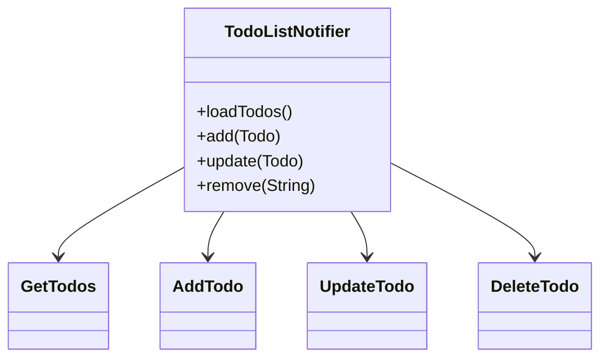
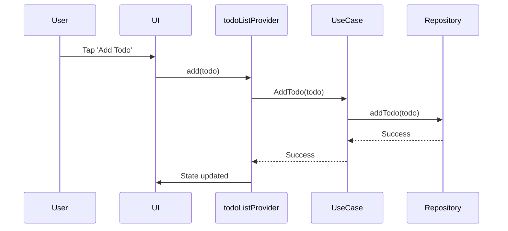

# Flutter TODO App – Riverpod, Clean Architecture, and Testable DI

## 1. Project Overview

This project is a robust Flutter TODO application built with:
- **Riverpod** for state management and dependency injection (no global service locator).
- **Clean Architecture**: clear separation of presentation, domain, and data layers.
- **Testability**: All dependencies are injected via Riverpod providers, making unit tests deterministic and easy to override.
- **Comprehensive Testing**: Provider overrides are used in tests to inject mocks and control app state.

---

## 2. Architecture

The project follows Clean Architecture principles:

- **Presentation Layer**: UI widgets and Riverpod providers (e.g., `todoListProvider`).
- **Application Layer (Usecases)**: Business logic (`GetTodos`, `AddTodo`, etc.).
- **Domain Layer**: Core entities (`Todo`, `TodoPriority`, etc.).
- **Infrastructure/Data Layer**: Data sources and repositories (e.g., Hive, local storage).

**Riverpod Providers** replace global service locators (like GetIt) for dependency injection, enabling:
- Fine-grained control over dependencies.
- Easy overrides in tests.
- No hidden singletons or global state.

---

## 3. Getting Started

### Prerequisites

- [Flutter SDK](https://flutter.dev/docs/get-started/install)
- Git

### Installation

```bash
git clone https://github.com/SreeAppStore/todo.git
cd todo
flutter pub get
```

### Running the App

```bash
flutter run -d android   # For Android
flutter run -d ios       # For iOS (on macOS)
flutter run -d chrome    # For Web
```

### Building APKs (Android)

- **Debug APK:**
  ```bash
  flutter build apk --debug
  # Output: build/app/outputs/flutter-apk/app-debug.apk
  ```
- **Release APK:**
  ```bash
  flutter build apk --release
  # Output: build/app/outputs/flutter-apk/app-release.apk
  ```

### Building for iOS

- **Debug:**
  ```bash
  flutter build ios --debug
  ```
- **Release:**
  ```bash
  flutter build ios --release
  ```

### Building for Web

- **Release:**
  ```bash
  flutter build web --release
  # Output: build/web/
  ```

### Running Tests and Coverage

```bash
flutter test
flutter test --coverage
```

---

## 4. Usage

### Example: `todoListProvider`

The main provider for TODO state:

```dart
final todoListProvider = StateNotifierProvider<TodoListNotifier, TodoListState>((ref) =>
  TodoListNotifier(
    getTodos: ref.read(getTodosProvider),
    addTodo: ref.read(addTodoProvider),
    updateTodo: ref.read(updateTodoProvider),
    deleteTodo: ref.read(deleteTodoProvider),
  ),
);
```

### Overriding Dependencies in Tests

```dart
final container = ProviderContainer(overrides: [
  getTodosProvider.overrideWithValue(MockGetTodos()),
  addTodoProvider.overrideWithValue(MockAddTodo()),
  // ...other overrides
]);
```

---

## 5. Testing

- Tests use `ProviderContainer` and provider overrides to inject mocks and control state.
- Debug sample data is **not injected** in tests or production.
- Example test setup:

```dart
test('Adding a todo', () async {
  final container = ProviderContainer(overrides: [
    // ...mock overrides
  ]);
  // ...test logic
});
```

---

## 6. Diagrams

### Class Diagram



### Sequence Flow



---

## 7. Contributing

- Create a feature branch (`git checkout -b feature/your-feature`)
- Make changes and add tests.
- Run all tests before committing: `flutter test`
- Submit a Pull Request (PR) with a clear description.

### Pre-commit Hook (Automated Build/Test/Coverage)

A pre-commit hook is provided in `.git/hooks/pre-commit`:
- Runs build for Android, iOS (on macOS), and Web
- Runs tests (commit allowed even if tests fail)
- Runs coverage if tests pass

Make it executable:
```bash
chmod +x .git/hooks/pre-commit
```

---

## 8. License

[MIT](LICENSE) or [Apache 2.0](LICENSE) – Choose your preferred license.

---

## 9. Dart Define Usage

### Using --dart-define for Test/Product Builds

You can control test/debug features at runtime using Dart environment variables:

- To enable test mode (e.g., inject debug sample data), build or run with:
  ```bash
  flutter run --dart-define=test=true
  flutter build apk --debug --dart-define=test=true
  flutter build apk --release --dart-define=test=false
  ```
- The app will only inject debug sample data if `--dart-define=test=true` is set.
